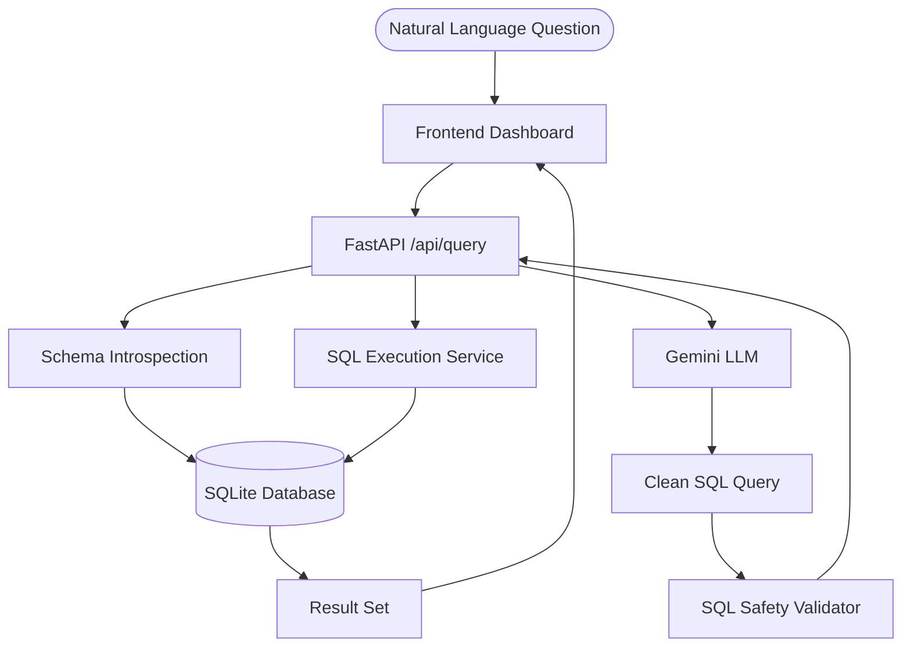

# 🗃️ Text-to-SQL Assistant

[](https://fastapi.tiangolo.com/)
[](https://www.sqlite.org/)
[](https://aistudio.google.com/)

An intelligent **Text-to-SQL** application that converts natural language questions into executable SQLite queries. Powered by **Google Gemini LLM** and **FastAPI**, with a stunning glassmorphism dashboard.

---

## ✨ Key Features

- **🔍 Natural Language Processing**: Transform human questions into complex SQL JOINs, aggregations, and filters.
- **🛡️ Secure Query Execution**: Automated SQL validation to block destructive operations (DROP, DELETE, UPDATE, etc.).
- **📊 Interactive Dashboard**: Modern, glassmorphism-themed frontend to visualize database schema and results.
- **📦 Auto-Schema Introspection**: Dynamically reads your SQLite tables and injects them into the AI context.
- **🌱 Simple Seeding**: One-click database seeding with high-quality sample data.
- **📜 Query History**: Track and review past translations and their generated SQL.

---

## 🛠️ Tech Stack

- **Backend**: Python 3.10+, FastAPI, SQLAlchemy, Pydantic
- **LLM**: Google Gemini (via `google-generativeai`)
- **Frontend**: Vanilla JS, CSS3 (Glassmorphism), Font Awesome
- **Database**: SQLite (File-based)

---

## 🏗️ Architecture



---

## 🚀 Quick Start

### 1. Clone & Install
```bash
git clone https://github.com/saikousik22/text-to-sql.git
cd text-to-sql
pip install -r requirements.txt
```

### 2. Environment Setup
Create a `.env` file in the root directory:
```bash
GEMINI_API_KEY=your_google_ai_studio_api_key
DATABASE_URL=sqlite:///./data/sample.db
```
> [Get your Gemini API key here](https://aistudio.google.com/apikey)

### 3. Run the Backend
```bash
uvicorn app.main:app --reload
```

### 4. Run the Frontend
You can open `frontend/index.html` directly in your browser or serve it using Vite:
```bash
cd frontend
npm install
npm run dev
```

---

## 📖 Example Queries

- *"Show me the top 5 highest paid employees"*
- *"What is the average salary by department?"*
- *"Who was hired after 2022 in the Engineering department?"*
- *"List all active projects with their budget and department name"*

---

## 🔗 API Endpoints

| Method | Endpoint | Description |
| :--- | :--- | :--- |
| `POST` | `/api/query` | NL → SQL → Execute |
| `GET` | `/api/tables` | View DB Schema |
| `POST` | `/api/seed` | Seed Sample Data |
| `GET` | `/api/history` | View Past Queries |
| `GET` | `/docs` | Swagger UI |

---

## 📜 License
Internal Project - 2026. Built with ❤️ for Data Intelligence.
